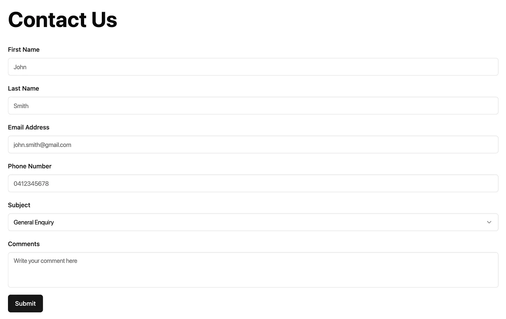

I’ve recently been working on a web app for my local running club to streamline timing and management operations. As part of this app, I wanted to create a **Contact Us** form. With the app’s open-source backend [Pocketbase](https://pocketbase.io/) (which I will henceforth refer to as **PB**), this turned out to be a bit more difficult than I thought.

Don’t get me wrong, PB is an incredible tool. Gani Georgiev (alongside the community) has built an awesome Firebase alternative that’s streamlined so much work for me in creating this app. It’s a true testament to the power of open source software, but at times it requires a bit more thinking, especially when you have to add something somewhat custom.

So, here’s how I implemented the form in React using PB as a backend that sends a copy of all submissions to our club email address.



There are two approaches you could use to accomplish this in Pocketbase:

1. [Add your own API route](https://pocketbase.io/docs/js-routing/#registering-new-routes) that accepts details for an email and sends it from the server
2. Create a new table for storing the form submissions and [intercept the write operation](https://pocketbase.io/docs/js-records/) once it’s complete

I decided to opt for the latter, as it allows us to keep a record of all of the form submissions that people have made. From here onwards I will discuss my implementation for option two, but you could very well use option one if you do not want/need to keep the history!

We first need to create a new collection (basically a table), I called mine `contact_us_submissions` and gave it the following schema:

```
"id": uuid
"firstName": string
"lastName": string
"emailAddress": string
"phoneNumber": string
"subject": string
"comments": string
```

I then added the following function in my `pb_hooks` folder:

```
onRecordAfterCreateRequest((e) => {
  const message = new MailerMessage({
    from: {
      address: e.record.get("emailAddress"),
      name: e.record.get("firstName") + " " + e.record.get("lastName"),
    },
    to: [{ address: "emailtosendto@email.com" }],
    subject: e.record.get("subject"),
    html: e.record.get("comments") + " " + e.record.get("phoneNumber"),
  });

  $app.newMailClient().send(message);
}, "contact_us_submissions");
```

Now every time someone submitted the form, it would store it in the database and send us an email copy! Here is the React code for the email submission:

```
async function onSubmit(values) {
    await pb.collection("contact_us_submissions").create({
      firstName: values.firstName,
      lastName: values.lastName,
      emailAddress: values.emailAddress,
      phoneNumber: values.phoneNumber,
      subject: values.subject,
      comments: values.comments,
    });
    toast({
      title: "Form Submitted!",
      description: "We'll get back to you as soon as we can.",
    });
  }
```

Hope that helps someone out there!
