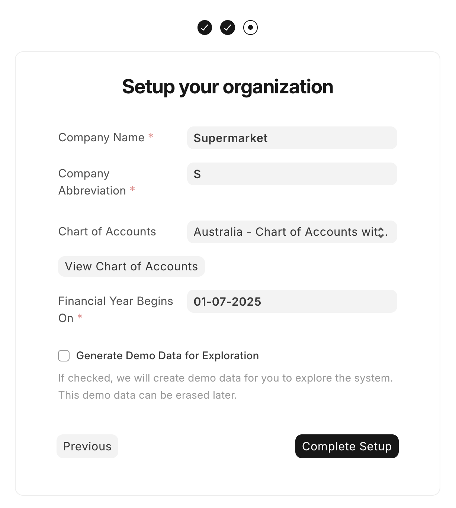
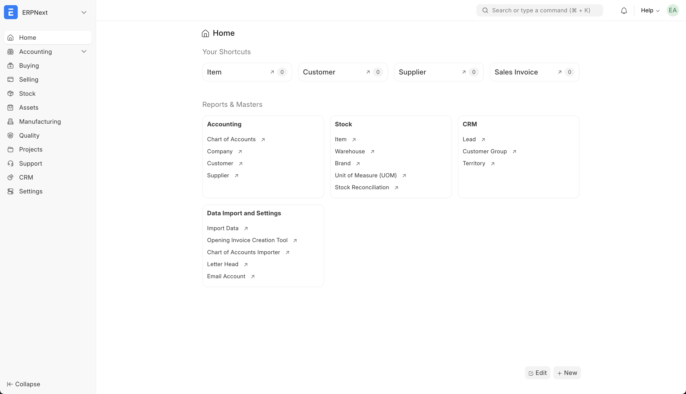

Assuming you gave the commands 5-10 minutes to run, and you didn't see any errors, you should now have ERPNext installed on your VPS. Head to `erp.yourdomain.com` (replace `yourdomain.com` with your actual domain) in your web browser and you should see a login screen. Enter the username `Administrator` and the password `admin` and press `Login` to go to the next page. Here, select the settings suited to your location and the currency that your business uses, and press `Next`.

Enter your full name, email address, and a password (the more characters the better - I usually aim for at least 20), then click `Next`. Now you can input your organisation's details. This includes the name, abbreviation, chart of accounts, and financial year start date. Do **not** tick the `Generate Demo Data` box, we want to start with a clean slate.

Here's a sample set of inputs (click to expand)

Press `Next` again. ERPNext will show you a loading screen while it sets up your organisation, which usually takes less than a minute.

Once it's finished, you'll see the ERPNext dashboard (click for screenshot)

If you'd like to add other users to help you set things up:

1. Head to `https://erp.yourcompany.com/app/user`
2. Press the `Add User` button in the top right.
3. Fill out the email and first name of the new user
4. Allocate them roles based on what they do in the business. Try to follow the principle of least privilege - i.e. give them only the permissions they will need.

Finally, we **need** to do a small but important security uplift to make the administrator password stronger:

1. Log out of your account by clicking your user icon in the top right and selecting `Log Out`.
2. Log in as `Administrator` with the password `admin`.
3. Head to `https://erp.yourcompany.com/app/user/Administrator#settings_tab`
4. Change the password to something much stronger (50+ characters ideally).
5. Press `Save`

I also recommend you set up an IP restriction in the security settings to only allow logins from your office or home IP address if it is static.

That's all for this blog post! In the next one, we'll dive into setting up the items that your company buys and sells. Click [here](https://lachlanmacphee.com/blog/006-erpnext-items) to move to the next step.
