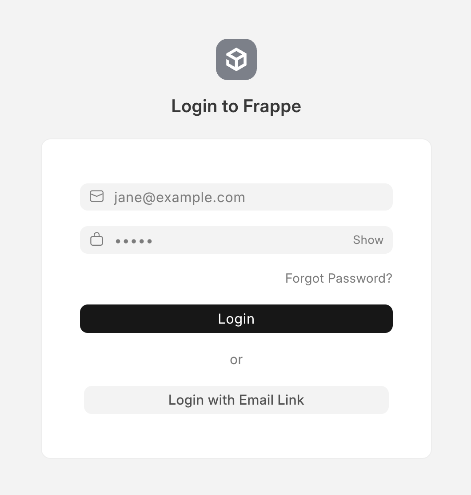
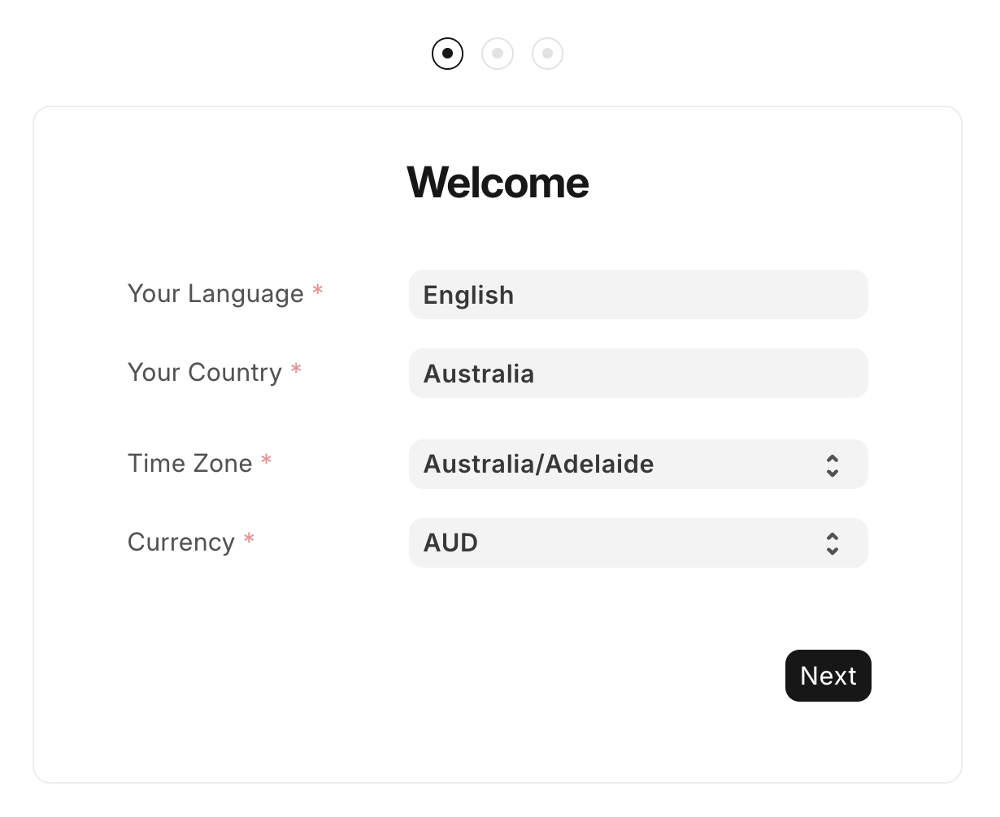
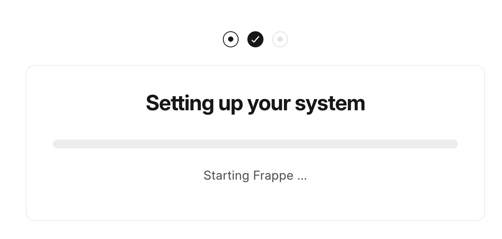
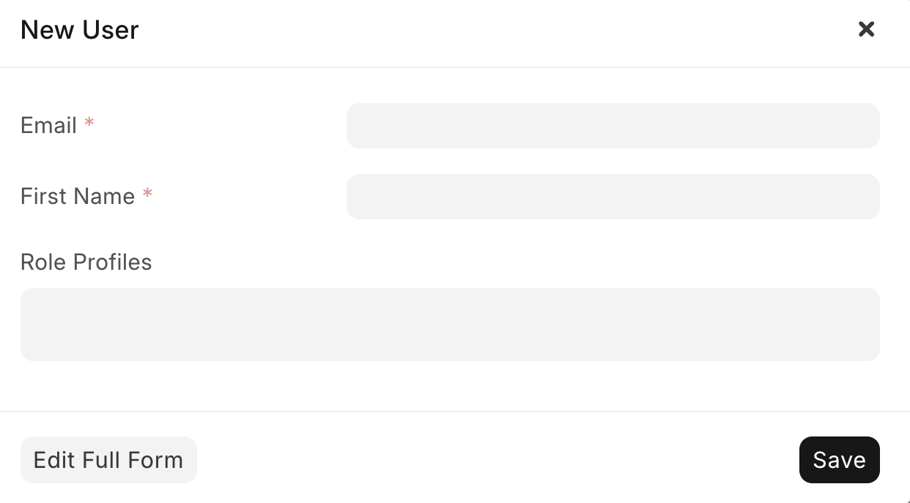

Assuming you gave the commands 5-10 minutes to run, and you didn't see any errors, you should now have ERPNext installed on your VPS and accessible via your domain.

Head to `erp.yourdomain.com` (replace `yourdomain.com` with your actual domain) in your web browser. You should see a login screen that looks like this:

Enter the username `Administrator` and the password `admin`. You will then see a welcome screen. Select the settings suited to your location and the currency that your business operates in:

You then need to setup an account. Enter your full name, email address, and a password (50+ characters ideally), then click "Next". Now you can input your organisation's details. This includes the name, abbreviation, chart of accounts, and financial year start date. Do **not** tick the `Generate Demo Data` box, we want to start with a clean slate.

ERPNext will show you a loading screen while it sets up your organisation. This may take a few minutes, so be patient.

Once it's finished, you'll see the ERPNext dashboard. Yay! Let's not celebrate just yet though, we still have a bit more setup to do.

If you'd like to add other users to help you with your company's setup, head to `https://erp.yourcompany.com/app/user` and click the `Add User` button in the top right. Fill out the email and first name of the new user, and allocate them roles based on what they do in the business. In general, you should aim to allocate the minimum amount of roles for them to do what they need to do. If you're not sure which role to allocate, just take a guess, you can always allocate them more later!

Finally, we **need** to do a small but important security uplift to make the administrator password stronger. Log out of your account by clicking your user icon in the top right and selecting `Log Out`. Then, log back in as `Administrator` with the password `admin`. Head to `https://erp.yourcompany.com/app/user/Administrator#settings_tab` and change the password to something much stronger (50+ characters ideally), then hit `Save`. I also recommend you set up an IP restriction in the security settings to only allow logins from your office or home IP address.

That's all for this blog post! In the next one, we'll dive into setting up the items that your company buys and sells. Click [here](https://lachlanmacphee.com/blog/006-erpnext-items) to move to the next step.
