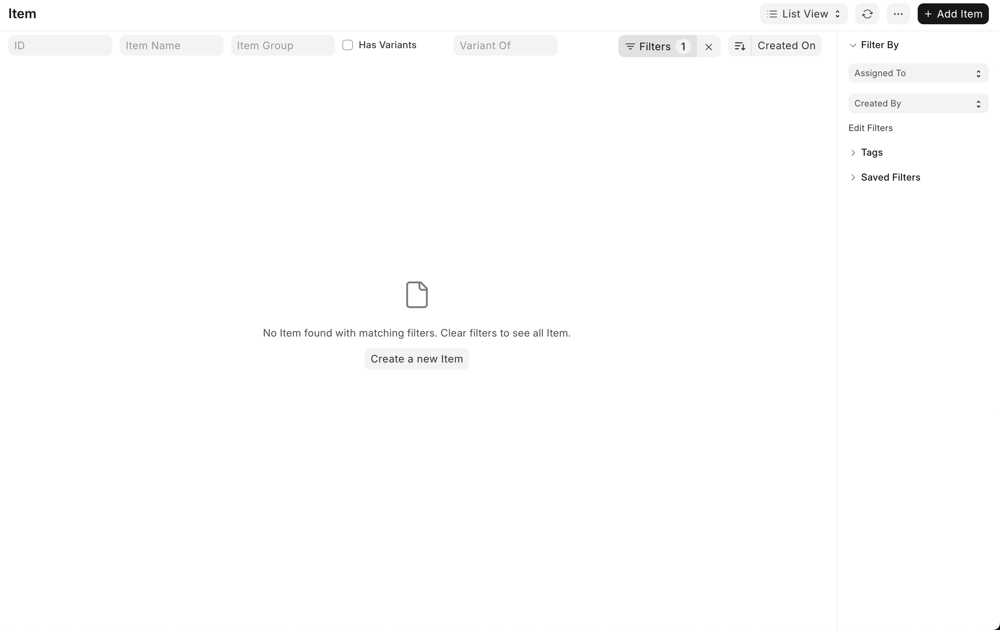
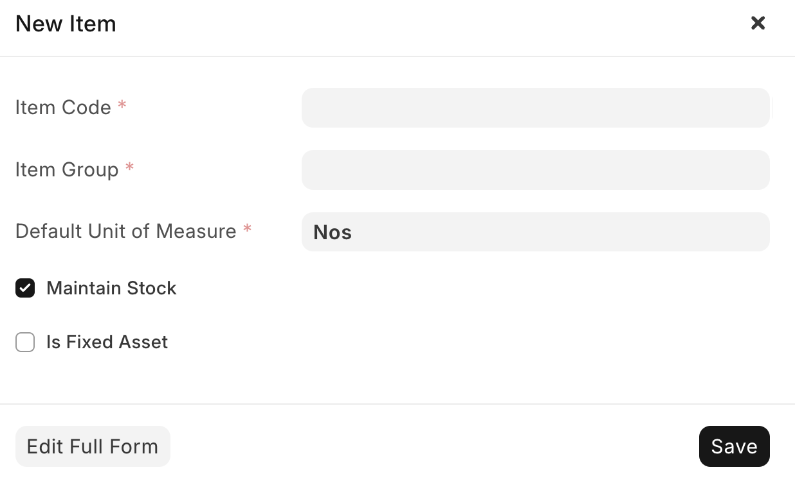
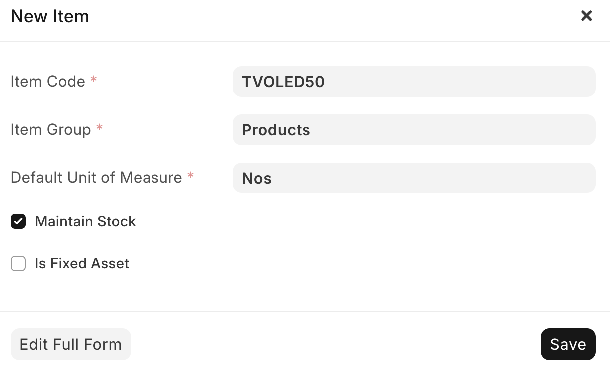
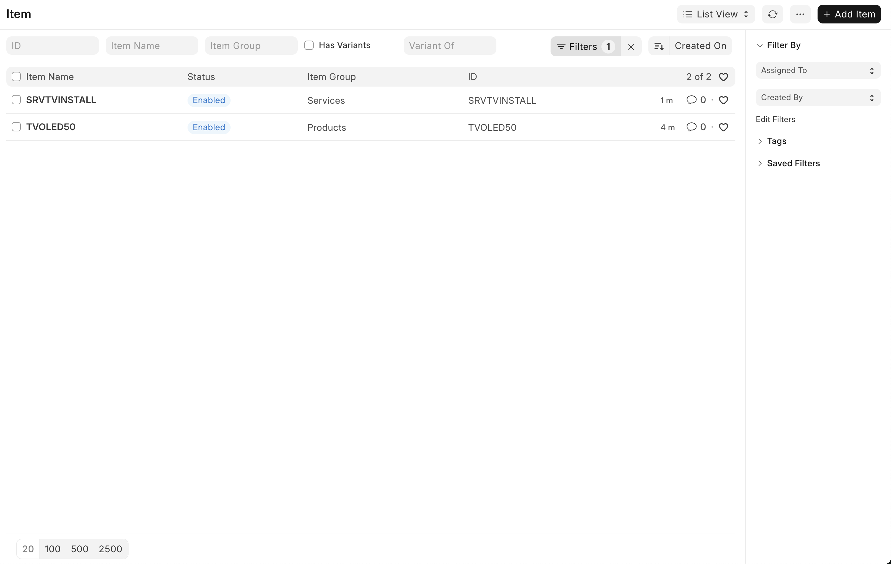
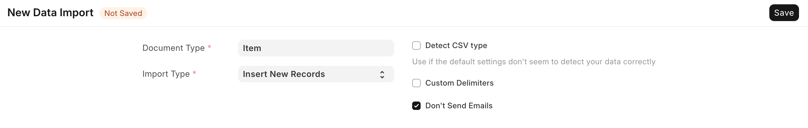
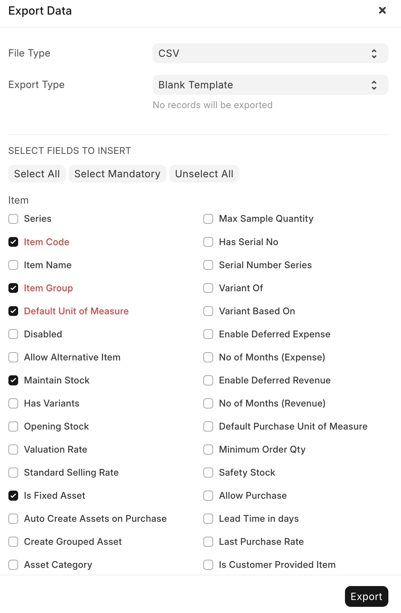
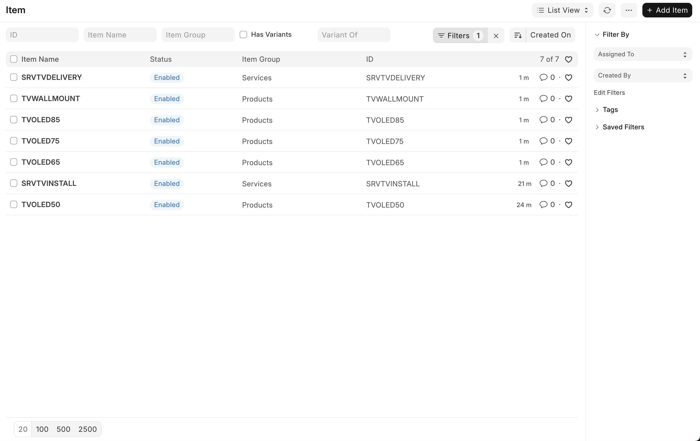
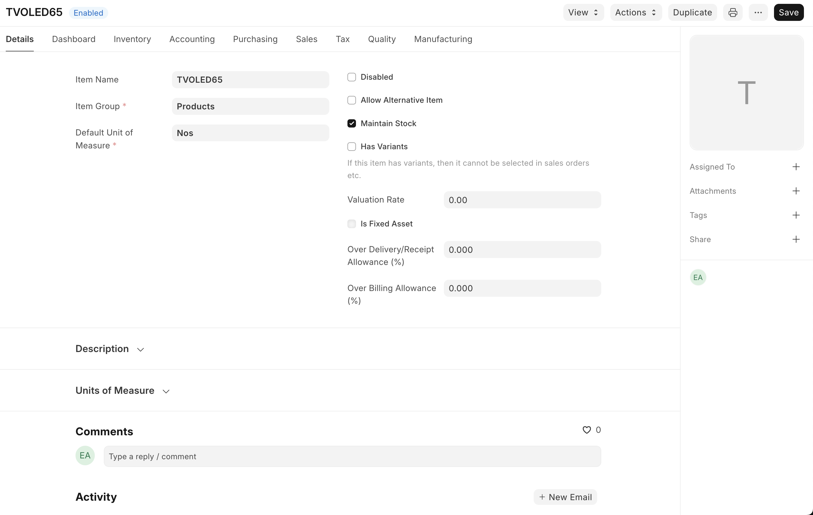

In the last blog post, we set up ERPNext on our VPS and added our company information. Now, it's time to add the products and services our business purchases and sells.

On the left toolbar, click on the `Stock` module, then click on `Items` under either `Quick Access` or `Items Catalogue`.

<details>
<summary>You should see a screen that looks something like this (click to expand)</summary>



</details>

This is where all the products and services your business buys and sells will be listed. As you can see, it's currently empty. To add a new item, click the `Add Item` button in the top right corner.

<details>
<summary>You will be presented with the following options (click to expand)</summary>



</details>

Let's go through the available fields to understand what they mean:

- **Item Code**: This is a unique identifier for the item. It can be a SKU, barcode, or any other code that makes sense for your business. Ideally, you should develop a naming standard for your items to make them easier to find and manage. Refer to [this](https://docs.frappe.io/erpnext/user/manual/en/item-codification) for some handy tips.
- **Item Group**: This is a category that helps you organise your items. By default, ERPNext comes with some pre-defined item groups such as `Products`, `Consumables`, and `Services` which should fit most use cases. You can create your own item groups if needed.
- **Default Unit of Measure**: This is the unit in which the item is measured. Common units include `Nos` (numbers), `Kg` (kilograms), `Litre` (litres), etc. For our LED TV, we'll use `Nos`, since we sell them by the unit. Note that the spelling of the unit can sometimes switch between American and British English (e.g. there is `Litre` but also `Meter`).
- **Maintain Stock**: Tick this box if you want ERPNext to track the stock levels of this item and create stock ledger entries for each transaction. For physical products, you should tick this box. For services, you would very likely untick it.
- **Is Fixed Asset**: Tick this box if the item is a fixed asset, such as machinery or equipment that your business uses. For items you sell to customers, leave this box unticked.

<details>
<summary>Here's an example of how to fill out the form for a new item, in this case, a 50-inch OLED TV that our mock consumer electronics business sells:</summary>



</details>

Once you've filled out the form, click the `Save` button in the bottom right corner. You will be taken back to the items list. If the item does not appear, press the `Refresh` button in the top right corner near the `Add Item` button.

Now that I've created a product, let's repeat the same steps to create a service. This time, I'll create a `TV Install` service that our mock business offers, ensuring I untick the `Maintain Stock` checkbox for this one.

<details>
<summary>Here's what the items list looks like after adding a product and a service (click to expand)</summary>



</details>

You can imagine this would be rather tedious if you had to add hundreds or thousands of items one by one. Fortunately, ERPNext has a feature that allows you to import items in bulk using a CSV file. This is especially useful if you're migrating from another system or have a large inventory.

Start by clicking the `Menu` button (three dots) in the top right corner of the items list page. From the dropdown, select `Import` to go to the Data Import page. Click the `Add Data Import` button in the top right corner. In the `Select Document Type` dropdown, choose `Item`, then in the `Import Type` dropdown, select `Insert New Records`.

<details>
<summary>This is what the Data Import form should look like (click to expand)</summary>



</details>

Once you've filled out the form, click the `Save` button in the bottom right corner. This will then change the page layout and give you the option to download a template CSV file. Click the `Download Template` button to open a modal which allows you to select what fields you'd like to include for the items you're importing. Alongside the existing fields pre-ticked by ERPNext, tick the `Maintain Stock` and `Is Fixed Asset` checkboxes to include those fields in the template. Click the `Export` button at the bottom right to download the template file.

<details>
<summary>Here's what your field selection should look like at minimum:</summary>



</details>

Next, open the downloaded file in your preferred spreadsheet software like Microsoft Excel or Google Sheets and then fill it out with your items. Here's an example of what the filled-out CSV file looks like for our mock business (note: these items are additional to the ones we created manually earlier):

```csv
Item Code,Item Group,Default Unit of Measure,Maintain Stock,Is Fixed Asset
TVOLED65,Products,Nos,Yes,No
TVOLED75,Products,Nos,Yes,No
TVOLED85,Products,Nos,Yes,No
TVWALLMOUNT,Products,Nos,Yes,No
SRVTVDELIVERY,Services,Nos,No,No
```

Head back to the Data Import page in ERPNext and click the `Import File` button to select your filled-out CSV file. After selecting the file, click the `Upload` button. ERPNext will then process the file and show you a preview of the data to be imported. If everything looks good, click the `Start Import` button and refresh the page. You should see a green `Success` label at the top indicating that the import was successful. Now, click the `Go to Item List` button to return to the items list.

<details>
<summary>You should now see all the items added via the CSV import (click to expand)</summary>



</details>

Now that we've added a number of items, let's take a look at some of the other fields available when creating or editing an item. Open one of the items by clicking on its name in the items list.

<details>
<summary>This will take you to a detail page that looks like this (click to expand)</summary>



</details>

At the top, you'll see several tabs. Let's go through what each of these are for:

- **Details**: This tab contains basic details about the item, such as its name, group, and unit of measure, alongside some more advanced settings. Let's explore what each of these are:
  - **Disabled**: Reasonably self explanatory. It allows you to control whether or not this product can be used. You might disable a product if it's old but you still have sales orders for it and wish to keep those intact.
  - **Allow Alternative Item**: Mostly used for manufacturing businesses. It means that this item can be substituted for something else in the manufacturing process.
  - **Maintain Stock**: Discussed above.
  - **Has Variants**: For our consumer electronics business, it might be where you have a TV that comes in multiple colours. You would setup a "master" item, and then give each colour its own variant.
  - **Valuation Rate**: The cost of an item in inventory. Usually based on the price you paid for that item when it was bought.
  - **Is Fixed Asset**: Discussed above.
  - **Over Delivery/Receipt Allowance** and **Over Billing Allowance**: Explained [here](https://docs.frappe.io/erpnext/user/manual/en/allow-over-delivery-billing-against-sales-order-upto-certain-limit)
- **Dashboard**: At the top of this page, you'll see an activity heatmap, indicating the item's stock movements over time. Underneath, there are a variety of shortcuts. Some of the most important ones for our consumer electronics business would be the item price and pricing rules, quotations/sales orders/invoices for selling the item, and supplier quotations/purchase orders for buying it. If your company does any sort of manufacturing, the "Groups" and "Manufacture" sections might be useful to you. The "Traceability" section is useful for items with serial numbers or ones that come in batches.
- **Inventory**: Set the item's shelf life (0 if it doesn't have one), end of life, warranty period, weight per unit, and other inventory-related settings. You'll also find a barcodes table, which allows you to add multiple barcodes for the item if you use those for tracking. There's an auto re-order section where you can set minimum and maximum stock levels to help manage inventory, and at the bottom of the tab, there's a serial numbers and batches section if you wish to enable that functionality for this item.
- **Accounting**: Controls for deferred accounting of this item, and item defaults for each company (e.g. which warehouse it sits in and its default price list).
- **Purchasing**: Purchasing information for the item, such as the default purchase unit of measure, minimum order quantity, safety stock, lead time, and last purchase rate. This information will be used when creating purchase orders. Additionally, there are sections for supplier and foreign trade details.
- **Sales**: Similar to purchasing, it gives you a default unit of measure except this time for sales. There are also options for the maximum discount that can be provided on the item, whether commission should be granted on a sale, and whether it's allowed to be sold in the first place.
- **Tax**: Set tax-related information for the item, such as the tax category, when it's valid from, and the min/max net rates.
- **Quality**: Manage quality inspections and control for the item. You can set quality inspection templates and define whether inspections are required before purchase or delivery.
- **Manufacturing**: Whether to include the item in manufacturing, and if the item is subcontracted to a vendor, whether your company supplies raw materials for a purchase.

That's all for this blog post. Hopefully you understand items a bit more now! In the next post, we'll explore **Customers & Suppliers**. I'm still writing that post, so please bear with me.
