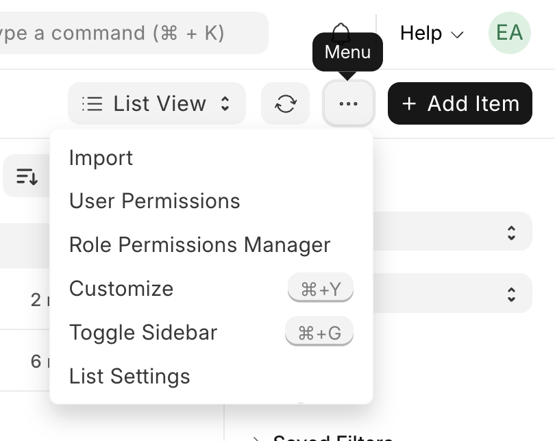

In the last blog post, we set up ERPNext on our VPS and added our company information. Now, it's time to add the products and services our business purchases and sells.

On the left toolbar, click on the `Stock` module, then click on `Items` under either `Quick Access` or `Items Catalogue`. You should see a screen that looks something like this:


This is where all the products and services your business buys and sells will be listed. As you can see, it's currently empty. To add a new item, click the `Add Item` button in the top right corner. You will be presented with the following options:


Let's go through the available fields to understand what they mean:

- **Item Code**: This is a unique identifier for the item. It can be a SKU, barcode, or any other code that makes sense for your business. Ideally, you should develop a naming standard for your items to make them easier to find and manage. Refer to the [ERPNext Item Codification documentation](https://docs.frappe.io/erpnext/user/manual/en/item-codification) for some handy tips.
- **Item Group**: This is a category that helps you organise your items. By default, ERPNext comes with some pre-defined item groups such as `Products`, `Consumables`, and `Services` which should fit most use cases. You can create your own item groups if needed.
- **Default Unit of Measure**: This is the unit in which the item is measured. Common units include `Nos` (numbers), `Kg` (kilograms), `Litre` (litres), etc. For our LED TV, we'll use `Nos`, since we sell them by the unit. Note that the spelling of the unit can sometimes switch between American and British English (e.g. there is `Litre` but also `Meter`).
- **Maintain Stock**: Tick this box if you want ERPNext to track the stock levels of this item. For physical products, you should tick this box. For services, you can leave it unticked.
- **Is Fixed Asset**: Tick this box if the item is a fixed asset, such as machinery or equipment that your business uses. For items you sell to customers, leave this box unticked.

Here's an example of how to fill out the form for a new item, in this case, a 50-inch OLED TV that our mock consumer electronics business sells:


Once you've filled out the form, click the `Save` button in the bottom right corner. You will be taken back to the items list. If the item does not appear, press the `Refresh` button in the top right corner near the `Add Item` button.

Now that I've created a product, let's repeat the same steps to create a service. This time, I'll create a `TV Install` service that our mock business offers, ensuring I untick the `Maintain Stock` checkbox for this one.

Here's what my list of items looks like after adding both the product and the service:


You can imagine this would be rather tedious if you had to add hundreds or thousands of items one by one. Fortunately, ERPNext has a feature that allows you to import items in bulk using a CSV file. This is especially useful if you're migrating from another system or have a large inventory.

Start by clicking the `Menu` button (three dots) in the top right corner of the items list page. From the dropdown, select `Import`, as shown here:



This will take you to the Data Import page. Click the `Add Data Import` button in the top right corner. In the `Select Document Type` dropdown, choose `Item`, then in the `Import Type` dropdown, select `Insert New Records`. This is what the form should look like:


Once you've filled out the form, click the `Save` button in the bottom right corner. This will then change the page layout and give you the option to download a template CSV file. Click the `Download Template` button to open a modal which allows you to select what fields you'd like to include for the items you're importing. Alongside the existing fields pre-ticked by ERPNext, tick the `Maintain Stock` and `Is Fixed Asset` checkboxes to include those fields in the template. We'll come back to some of the other fields later in this blog post. Click the `Export` button at the bottom right to download the template file.


Next, open the downloaded file in your preferred spreadsheet software like Microsoft Excel or Google Sheets and then fill it out with your items. Here's an example of what the filled-out CSV file looks like for our mock business (note: these items are additional to the ones we created manually earlier):

```csv
Item Code,Item Group,Default Unit of Measure,Maintain Stock,Is Fixed Asset
TVOLED65,Products,Nos,Yes,No
TVOLED75,Products,Nos,Yes,No
TVOLED85,Products,Nos,Yes,No
TVWALLMOUNT,Products,Nos,Yes,No
SRVTVDELIVERY,Services,Nos,No,No
```

Head back to the Data Import page in ERPNext and click the `Import File` button to select your filled-out CSV file. After selecting the file, click the `Upload` button. ERPNext will then process the file and show you a preview of the data to be imported. If everything looks good, click the `Start Import` button and refresh the page. You should see a green `Success` label at the top indicating that the import was successful. Now, click the `Go to Item List` button to return to the items list. You should now see all the items you added via the CSV file:


Now that we've added a sizeable number of items (at least for our mock business!), let's take a look at some of the other fields available when creating or editing an item. Open one of the items by clicking on its name in the items list. This will take you to the item detail page:


At the top, you'll see several tabs. Let's go through what each of these are for:

Coming soon!!

<!-- - **Details**: This tab contains the basic information about the item that we filled out when creating it, such as the item code, item group, and unit of measure. You can also add additional information here, such as a description, item image, and item variants (e.g., different sizes or colors).
- **Dashboard**: This tab provides an overview of the item's stock levels, recent transactions, and other relevant information. It's a quick way to see how the item is performing in terms of sales and inventory.
- **Inventory**: This tab is where you can manage the stock levels of the item. You can see the current stock level, reorder level, and reorder quantity. You can also create stock entries to adjust the stock levels manually.
- **Accounting**: This tab is where you can set the item's valuation method (e.g., FIFO, LIFO, Moving Average) and the default expense and income accounts. This is important for accurate financial reporting.
- **Purchasing**: This tab allows you to set default purchasing information for the item, such as the preferred supplier and purchase rate. This information will be used when creating purchase orders.
- **Sales**: This tab allows you to set default sales information for the item, such as the default sales price and tax category. This information will be used when creating sales orders.
- **Tax**: This tab allows you to set tax-related information for the item, such as the tax category and applicable taxes. This is important for compliance with tax regulations.
- **Quality**: This tab is used to manage quality inspections and control for the item. You can set quality inspection templates and define quality parameters.
- **Manufacturing**: This tab is used to manage manufacturing-related information for the item. You can set the item's bill of materials (BOM) and routings if the item is manufactured in-house. -->
